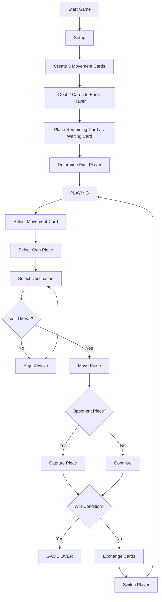
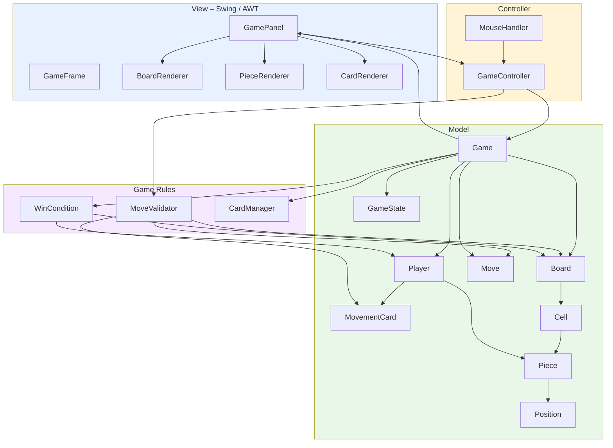
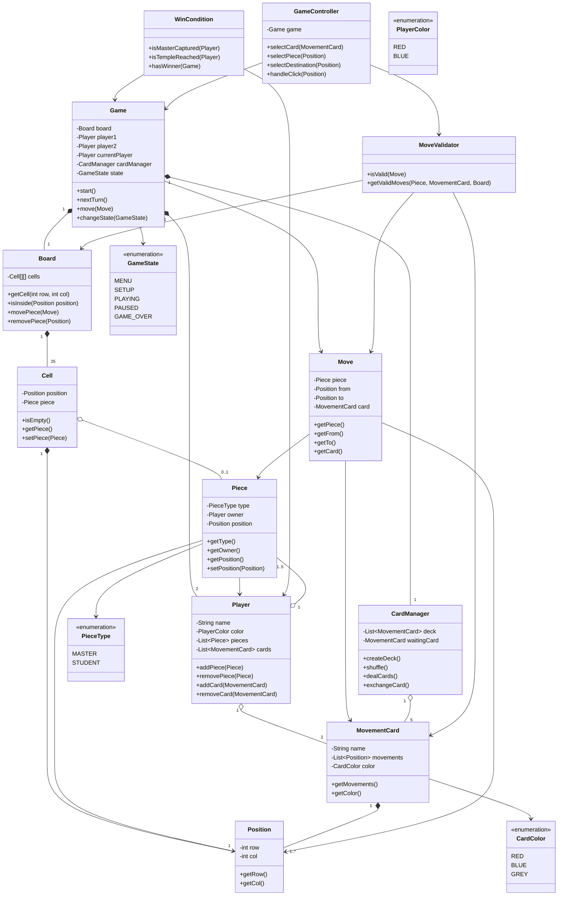
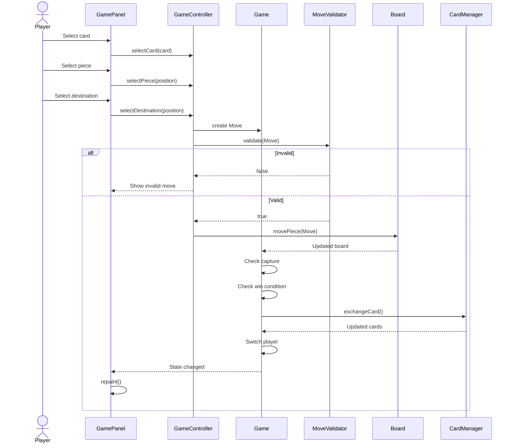
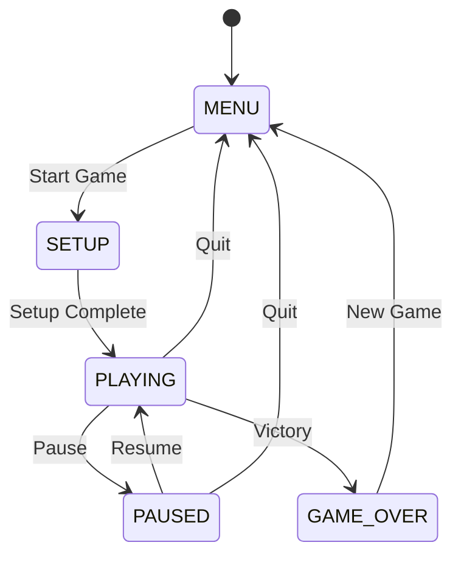

# Onitama – Java Board Game

## 1. Project Overview

Onitama is a 2-player strategy board game implemented in Java.

The project focuses on:

- Object-Oriented Programming (OOP)
- Java Swing / AWT
- Graphics and drawing
- Event handling
- Animation
- Timers
- Game state management
- Movement validation and collision detection
- Multithreading where appropriate
- Design patterns
- Save / Load functionality

The project is designed so that the main evaluation focus is on **program architecture, game logic, state management, event handling, animation, collision detection, concurrency, and code quality**, rather than purely visual appearance.

---

## 2. Game Rules

### Board

- Board size: **5 × 5**
- Number of players: **2**
- Each player has:
    - 1 Master
    - 4 Students
- Each player therefore has 5 pieces.

### Movement Cards

At the beginning of a game:

- 5 movement cards are randomly selected from the card deck.
- Each player receives 2 cards.
- The remaining card is placed beside the board as the waiting card.
- Only these 5 cards are used during the current game.
- The first player is determined by the color/mark on the waiting card.

### Turn

During a turn:

1. The current player chooses one of their two movement cards.
2. The player chooses one of their pieces.
3. The player chooses a destination according to the selected card.
4. The move is validated.
5. If valid, the piece moves.
6. An opponent's piece on the destination cell is captured.
7. The used card is exchanged with the waiting card.
8. The next player takes their turn.

If neither card provides a valid movement for a piece, the player still has to choose one card, but the piece may remain in its current position if no valid move exists.

### Movement Rules

A move is invalid when:

- The destination is outside the 5 × 5 board.
- The selected piece does not belong to the current player.
- The selected card does not belong to the current player.
- The destination contains one of the current player's own pieces.
- The movement does not match the selected movement card.

A move is valid when:

- The destination is inside the board.
- The piece belongs to the current player.
- The selected card belongs to the current player.
- The movement matches the selected card.
- The destination is empty or contains an opponent's piece.

### Win Conditions

A player wins when either:

1. The opponent's Master is captured.
2. The player's Master reaches the opponent's Temple.

---

# 3. Game Flow



---

# 4. High-Level Architecture

The project follows an **MVC-style architecture**.



---

# 5. Package Structure

```text
src/
└── com/onitama/
    │
    ├── Main.java
    │
    ├── model/
    │   ├── Game.java
    │   ├── Board.java
    │   ├── Cell.java
    │   ├── Position.java
    │   ├── Player.java
    │   ├── Piece.java
    │   ├── MovementCard.java
    │   ├── Move.java
    │   └── GameState.java
    │
    ├── rules/
    │   ├── MoveValidator.java
    │   └── WinCondition.java
    │
    ├── card/
    │   └── CardManager.java
    │
    ├── controller/
    │   └── GameController.java
    │
    ├── view/
    │   ├── GameFrame.java
    │   ├── GamePanel.java
    │   ├── BoardRenderer.java
    │   ├── PieceRenderer.java
    │   └── CardRenderer.java
    │
    ├── input/
    │   └── MouseHandler.java
    │
    └── util/
        └── ...
```

---

# 6. Class Diagram



---

# 7. Responsibility of Each Main Class

| Class | Responsibility |
|---|---|
| `Game` | Controls the overall game and turn flow |
| `Board` | Stores the 5 × 5 board and pieces |
| `Cell` | Represents one board cell |
| `Position` | Represents row/column coordinates |
| `Player` | Stores player's pieces and movement cards |
| `Piece` | Represents Master/Student |
| `MovementCard` | Stores one movement pattern |
| `Move` | Represents one attempted/valid move |
| `CardManager` | Creates, deals, and exchanges cards |
| `MoveValidator` | Checks whether a move is legal |
| `WinCondition` | Checks victory conditions |
| `GameController` | Connects user input to the game model |
| `GamePanel` | Main Swing game surface |
| `BoardRenderer` | Draws the board |
| `PieceRenderer` | Draws pieces |
| `CardRenderer` | Draws movement cards |
| `MouseHandler` | Handles mouse input |
| `GameState` | Represents current game state |

---

# 8. Important Design Principle

The project should separate **game logic** from **visual rendering**.

Bad:

```java
// GamePanel.java

if (mouseClicked) {
        if (pieceBelongsToPlayer && moveIsValid && ...) {
        // move piece
        // capture piece
        // change card
        // check victory
        }
        }
```

Better:

```text
MouseHandler
      ↓
GameController
      ↓
Game
      ↓
MoveValidator
      ↓
Board / Player / CardManager
      ↓
Game state updated
      ↓
GamePanel.repaint()
```

The UI should primarily display the current state and send user input to the controller.

---

# 9. Turn Processing

A normal turn should conceptually follow:



---

# 10. Game State



---

# 11. Future Extensions

These should only be implemented after the core game works.

### Level 1 – Core

- Two-player local game
- Full movement rules
- Card exchange
- Capture
- Temple victory
- Master capture victory
- Turn management

### Level 2 – Game quality

- Animation
- Sound effects
- Pause / Resume
- Better UI
- Move highlighting
- Invalid move feedback

### Level 3 – Persistence

- Save game
- Load game
- Serialization
- Replay / move history

### Level 4 – Advanced

- AI opponent
- Multiple AI strategies
- Leaderboard
- Database
- Multiplayer networking

The team should avoid implementing advanced features before the core game is stable.

---

# 12. Suggested Development Order

```text
1. Model
   ↓
2. Board + Piece
   ↓
3. Movement Cards
   ↓
4. Move Validation
   ↓
5. Turn System
   ↓
6. Win Conditions
   ↓
7. Basic Swing UI
   ↓
8. Mouse Interaction
   ↓
9. Animation
   ↓
10. Save / Load
   ↓
11. AI / Multiplayer / Other extensions
   ↓
12. Testing + Refactoring
```

---

# 13. Team of 5 – Initial Responsibility

| Member | Main Responsibility |
|---|---|
| Member 1 | Model: `Game`, `Board`, `Cell`, `Position`, `Piece`, `Player` |
| Member 2 | Cards: `MovementCard`, `CardManager`, movement patterns |
| Member 3 | Rules & Controller: `Move`, `MoveValidator`, `WinCondition`, `GameController` |
| Member 4 | UI: Swing, rendering, mouse interaction |
| Member 5 | Animation, state management, save/load, testing and integration |

All members should participate in code review and integration.

---

# 14. Git Strategy

Recommended branches:

```text
main
  │
  ├── develop
  │    │
  │    ├── feature/model
  │    ├── feature/cards
  │    ├── feature/rules
  │    ├── feature/ui
  │    └── feature/animation
```

Recommended workflow:

```text
feature branch
      ↓
commit
      ↓
Pull Request
      ↓
Code Review
      ↓
develop
      ↓
Stable version
      ↓
main
```

Do not directly push experimental work to `main`.

---

# 15. Definition of Done – Core Version

The core version is considered complete when:

- [ ] Game starts correctly.
- [ ] Board is 5 × 5.
- [ ] Both players have 1 Master + 4 Students.
- [ ] Five cards are selected.
- [ ] Each player receives two cards.
- [ ] One waiting card exists.
- [ ] First player is determined.
- [ ] Player can select a card.
- [ ] Player can select their own piece.
- [ ] Valid destinations can be selected.
- [ ] Invalid destinations are rejected.
- [ ] Own pieces cannot be captured.
- [ ] Opponent pieces can be captured.
- [ ] Cards are exchanged after a turn.
- [ ] Turns alternate correctly.
- [ ] Master capture triggers victory.
- [ ] Temple occupation triggers victory.
- [ ] Game enters `GAME_OVER`.
- [ ] Player can start a new game.

---

# 16. Notes

The architecture should remain simple enough for a student project.

Do not add a class, pattern, framework, database, or thread unless it has a clear responsibility in the game.

The priority is:

**Correct game logic → clean architecture → stable interaction → animation/UI → extensions.**


---

# 13. Detailed Component Design

This section is the implementation checklist for the team. Names can be adjusted during implementation, but keep each class focused on one responsibility.

## 13.1 Model: game data and rules-independent objects

| Component | Kind | Main fields / methods | Responsibility and notes |
|---|---|---|---|
| `Game` | Class | `Board board`, two `Player`s, `Player currentPlayer`, `CardManager cardManager`, `GameState state`; `start()`, `tryMove(Move)`, `switchTurn()`, `finish(Player)` | Owns the overall match flow. Coordinates validation, board updates, card exchange, turn switching, and game-over state. It should not draw anything. |
| `Board` | Class | `Cell[][] cells`; `getCell(Position)`, `isInside(Position)`, `movePiece(Move)`, `removePiece(Position)` | Represents the 5×5 board and updates occupancy. It should not decide whether a move follows a card; that belongs to `MoveValidator`. |
| `Cell` | Class | `Position position`, `Piece piece`; `isEmpty()`, `getPiece()`, `setPiece(Piece)` | Represents one square. `piece == null` means empty. A cell refers to a piece currently occupying it; it does not own the piece's lifetime. |
| `Position` | Immutable class / Java `record` | `row`, `col`; `translate(dr, dc)`, `equals()`, `hashCode()` | Represents coordinates. Prefer immutable coordinates so a position cannot change unexpectedly after being used in a move or collection. |
| `Player` | Class | `name`, `PlayerColor color`, `List<Piece> pieces`, `List<MovementCard> cards`; `addCard()`, `removeCard()`, `getMaster()` | Stores one player's identity, pieces, and currently held cards. Captured pieces should be removed from the active-piece list or marked captured consistently. |
| `Piece` | Class | `PieceType type`, `Player owner`, `Position position`, `boolean captured`; getters and controlled position update | Represents either a Master or Student. Use `PieceType` rather than creating `Master extends Piece` and `Student extends Piece` unless those subclasses genuinely need different behavior. |
| `MovementCard` | Class | `name`, immutable list of movement offsets, `CardColor color`; `getMoves()` | Stores the card's relative movement pattern. A movement offset is a `(rowDelta, colDelta)` pair, not an absolute board coordinate. |
| `Move` | Immutable class / Java `record` | `Piece piece`, `Position from`, `Position to`, `MovementCard card` | Describes one proposed move. Construct it after the player has selected a card, piece, and destination. |
| `GameState` | Enum | `MENU`, `SETUP`, `PLAYING`, `PAUSED`, `GAME_OVER` | Defines the broad screen/game phase. Do not use it to represent every small selection step; use a separate selection field if needed. |
| `PlayerColor` | Enum | `RED`, `BLUE` | Identifies the two players. |
| `PieceType` | Enum | `MASTER`, `STUDENT` | Identifies piece roles. |
| `CardColor` | Enum | The colors used by the chosen card set | Stores the card's display/initiative color if the rule set uses it. Keep card color separate from player color. |

### Position representation

Use a small value object for movement offsets as well as board positions. Two reasonable choices:

- Reuse an immutable `Position` for `(rowDelta, colDelta)`, documenting that it is an offset in that context.
- Prefer a separate `MoveOffset` record/class to prevent mixing absolute positions and relative offsets.

Recommended if the team is comfortable with one extra type:

```java
public record Position(int row, int col) {}
public record MoveOffset(int rowDelta, int colDelta) {}
```

If the course's Java version does not support records, use ordinary classes with final fields, constructors, and getters.

## 13.2 Rules and card management

| Component | Kind | Main API | Responsibility |
|---|---|---|---|
| `MoveValidator` | Class | `isValid(Game, Move)`, `getLegalMoves(Game, Piece, MovementCard)` | Checks ownership, current turn, card possession, board bounds, movement offset, and friendly-piece blocking. It should not mutate the board. |
| `WinCondition` | Class | `getWinner(Game)` or `hasWon(Game, Player)` | Checks whether a Master was captured or reached the opponent's temple. Return a clear result; avoid duplicating victory logic in the UI. |
| `CardManager` | Class | `createDeck()`, `shuffle()`, `dealInitialCards()`, `exchangeUsedCard(Player, MovementCard)` | Builds/shuffles the deck, selects the five cards for a match, deals two per player, stores the waiting card, and exchanges cards after a turn. |
| `MoveOffset` | Immutable class / record | `rowDelta`, `colDelta` | Represents a relative movement printed on a card. |
| `GameResult` *(optional)* | Record/class | winner, reason | Makes the result explicit, e.g. `MASTER_CAPTURED` or `TEMPLE_REACHED`. Add only if it helps the implementation. |

**Important rule detail:** the exact card set, card orientation, starting rows, temple coordinates, and first-player rule must be taken from the rule set the team has agreed to implement. Encode these in one place rather than scattering magic numbers through the UI.

## 13.3 Controller and user input

| Component | Kind | Main API | Responsibility |
|---|---|---|---|
| `GameController` | Class | `selectCard(...)`, `selectPiece(Position)`, `selectDestination(Position)`, `handleBoardClick(Position)` | Converts user actions into model operations. Tracks the current selection and asks `Game` to perform a move. |
| `SelectionState` *(recommended)* | Enum | `SELECT_CARD`, `SELECT_PIECE`, `SELECT_DESTINATION` | Represents the current interaction step, independently of `GameState`. |
| `MouseHandler` | Class or listener | `mouseClicked(...)` | Converts pixel coordinates to a board cell or card hit target, then delegates to the controller. It should not contain game rules. |
| `BoardCoordinates` *(optional)* | Utility class | `pixelToPosition(...)`, `positionToBounds(...)` | Keeps pixel/grid conversion out of game logic. Useful if the board can resize. |

Keep the distinction clear:
- `GameState` answers: “Is the match in the menu, playing, paused, or over?”
- `SelectionState` answers: “During a turn, what is the player choosing right now?”

## 13.4 Swing view and rendering

| Component | Kind | Responsibility |
|---|---|---|
| `Main` | Class | Entry point. Starts the Swing UI on the Event Dispatch Thread using `SwingUtilities.invokeLater(...)`. |
| `GameFrame` | Class extending `JFrame` | Creates the window, menus, layout, and main panel. |
| `GamePanel` | Class extending `JPanel` | Main game surface. Calls renderers from `paintComponent(Graphics)` and requests repaint when the model changes. Avoid putting game rules here. |
| `BoardRenderer` | Class | Draws the 5×5 grid, temple cells, selection highlights, and legal-move hints. |
| `PieceRenderer` | Class | Draws Master and Student pieces based on model state. |
| `CardRenderer` | Class | Draws cards, their movement diagrams, ownership, selection, and waiting-card position. |
| `StatusPanel` *(optional)* | `JPanel` | Shows current player, selected card, instructions, winner, and restart controls. |
| `AnimationController` *(optional)* | Class | Owns animation state and a Swing `Timer`; updates visual interpolation and calls `repaint()`. Add after legal moves work. |

Swing painting should be repeatable: `paintComponent` draws the current state; it should not move pieces, change turns, deal cards, or determine a winner.

## 13.5 Interfaces and event contracts

Do not add interfaces just to make the design look more complex. Add them where they provide a useful boundary.

| Interface / contract | Suggested methods | Why / when to use |
|---|---|---|
| `GameListener` *(recommended)* | `onGameUpdated(Game)`, `onGameOver(GameResult)` | Lets the UI react to model changes without the model depending directly on Swing classes. A simpler alternative is for the controller to call `repaint()` explicitly. Choose one approach, not both everywhere. |
| `MoveRule` *(optional)* | `boolean isValid(Game, Move)` | Useful only if the team wants interchangeable rule implementations or testable rule modules. A single `MoveValidator` class is enough for the first version. |
| `Renderer` *(optional)* | `draw(Graphics2D, Game)` | Only useful if the team has multiple interchangeable renderers. Separate concrete renderer classes are sufficient initially. |
| `SaveService` *(optional)* | `save(Game, Path)`, `load(Path)` | A boundary for save/load implementation. Introduce when save/load becomes a committed feature. |
| `GameCommand` *(optional)* | `execute()` / `undo()` | Could support replay/undo, but is not required for the core game. Avoid implementing it before the basic turn flow works. |

For a manageable first version, the essential design can use **classes + enums**, with `GameListener` as the only interface if event-driven UI updates are needed.

## 13.6 Relationship guidance: composition vs reference

Use UML relationships according to actual ownership and lifetime:

- `Game` **composes** its `Board` and `CardManager` if they are created for and discarded with that match.
- `Board` **composes** its 25 `Cell` objects.
- `Cell` has a **temporary reference** to the piece currently occupying it. Do not model this as composition: pieces move between cells.
- `Piece` has a reference to its owning `Player`; `Player` may also keep a list of its pieces. This is an association, and the two-way links must be kept consistent.
- `Move` references a `Piece`, `MovementCard`, and positions; it describes an action and does not own those objects.
- `GamePanel`/renderers read model state; the model should not hold references to Swing components.

---

# 14. Detailed Work Allocation for a Team of Five

The split below gives each member a clear ownership area, concrete files, deliverables, dependencies, and integration checks. Replace Member 1–5 with actual names.

## Member 1 — Core Model and Board

**Owns:** `model/`

**Files:**
- `Position.java` and `MoveOffset.java` (coordinate/value types)
- `Cell.java`
- `Board.java`
- `Piece.java`
- `Player.java`
- `PieceType.java`
- `PlayerColor.java`

**Tasks:**
1. Implement immutable coordinate and movement-offset types.
2. Implement `Cell` with a position and optional piece.
3. Build a 5×5 `Board`; provide safe access and bounds checks.
4. Implement board occupancy updates: place a piece, move a piece, remove/capture a piece.
5. Implement `Piece` ownership, type, position, and capture status.
6. Implement `Player`'s active pieces and held cards, coordinating the card API with Member 2.
7. Establish invariants: a piece occupies at most one cell; a cell contains at most one piece; captured pieces are not left on the board.
8. Write unit tests for bounds, occupancy, moving, capturing, and piece ownership.

**Deliverable:** a model that can be tested without opening a window.

**Must coordinate with:** Member 2 on `MovementCard`/player card collections; Member 3 on the `Move` data structure and how board updates are called.

## Member 2 — Movement Cards and Card Rotation

**Owns:** `card/` and `MovementCard.java`

**Files:**
- `MovementCard.java`
- `MoveOffset.java` if assigned here instead of Member 1
- `CardManager.java`
- Optional `CardCatalog.java` for the predefined card set

**Tasks:**
1. Define the chosen set of movement cards as data, not hard-coded UI drawing logic.
2. Store each card's name, color/initiative mark, and relative movement offsets.
3. Implement deck creation and shuffling.
4. Select five cards for a match and deal two to each player, leaving one waiting card.
5. Implement card exchange after a move: used card becomes the waiting card; the old waiting card goes to the player who used the card, following the agreed rules.
6. Determine the first player from the waiting card's mark, according to the selected rule set.
7. Add tests for dealing, card counts, exchange, and first-player determination.

**Deliverable:** card logic works independently of the UI and can be verified with deterministic test decks.

**Must coordinate with:** Member 1 on `Player`'s card API; Member 3 on when exchange occurs and how a selected card is validated.

## Member 3 — Game Rules, Turn Flow, and Controller

**Owns:** `rules/` and `controller/`; coordinates the public API of `Game`

**Files:**
- `Move.java`
- `MoveValidator.java`
- `WinCondition.java`
- `Game.java`
- `GameState.java`
- `SelectionState.java`
- `GameController.java`
- Optional `GameResult.java`

**Tasks:**
1. Define the public game API that the UI will call.
2. Implement move validation: current player owns the piece; selected card belongs to them; destination is in bounds; movement matches a card offset; own pieces cannot be captured.
3. Generate legal destination cells for a selected piece and card so the UI can highlight them.
4. Implement the turn sequence: select card → select piece → choose destination → validate → move/capture → check win → exchange card → switch player.
5. Handle the no-legal-move case according to the team's agreed interpretation of the rules. Make the required card-use/pass behavior explicit and test it.
6. Implement both victory conditions: capture the opposing Master or move the Master to the opposing temple.
7. Prevent further moves after `GAME_OVER`.
8. Write unit tests for valid/invalid moves, captures, card exchange timing, turn switching, and victory.
9. Document the controller methods that Member 4 will call.

**Deliverable:** a complete, UI-independent playable rules engine.

**Must coordinate with:** Members 1 and 2 early, and give Member 4 a stable controller API before UI integration.

## Member 4 — Swing UI and Input

**Owns:** `view/` and `input/`

**Files:**
- `Main.java` (coordinate the entry point with the team)
- `GameFrame.java`
- `GamePanel.java`
- `BoardRenderer.java`
- `PieceRenderer.java`
- `CardRenderer.java`
- `MouseHandler.java`
- Optional `StatusPanel.java`
- Optional `BoardCoordinates.java`

**Tasks:**
1. Create the main window and layout.
2. Draw the 5×5 board, temple cells, pieces, cards, current-player indicator, and waiting card.
3. Draw the movement offsets on each card.
4. Convert mouse clicks into board positions or card selections.
5. Show selected card/piece and highlight legal destinations using controller-provided data.
6. Show invalid-move feedback, current turn, and game-over result.
7. Keep all rule decisions in `Game`/`MoveValidator`, not in drawing code.
8. Ensure painting is done in `paintComponent` and call `super.paintComponent(g)`.
9. Test resizing, click mapping, selection cancellation, and repaint behavior.

**Deliverable:** a playable interface connected to the controller.

**Must coordinate with:** Member 3 on controller method signatures and Member 2 on how card movement patterns are exposed for drawing.

## Member 5 — Integration, Testing, Animation, and Polish

**Owns:** cross-cutting quality work. This member should still implement concrete code, not only “help everyone.”

**Initial files/tasks:**
- `test/` test plan and integration tests
- Optional `AnimationController.java`
- Optional `SaveService` / save-load implementation, but only after core integration
- `README.md`, screenshots, usage instructions, and final demo checklist

**Tasks:**
1. Agree on package names, naming conventions, Java version, and public APIs with the team.
2. Set up the project structure and GitHub repository; add `.gitignore`.
3. Create a shared test checklist covering setup, card exchange, movement, capture, both win conditions, and restart.
4. Integrate each feature branch into `develop`; resolve merge conflicts with the relevant owner.
5. Run the full game from a clean checkout and test edge cases.
6. Implement one substantial extension after the core game is stable: preferably animation with `javax.swing.Timer`, or save/load if that is more valuable for the rubric.
7. Check that Swing UI updates happen on the Event Dispatch Thread and avoid unnecessary background threads. A turn-based board game usually does not need multithreading for core logic.
8. Maintain README diagrams, setup instructions, controls, known limitations, and screenshots.
9. Prepare the final demo flow and divide presentation topics among all five members.

**Deliverable:** integrated, tested, documented release, plus one clearly owned extension.

## Shared responsibilities and hand-off rules

- **All members:** review the class/API contract before coding against another member's files.
- **Member 1 → Member 3:** provide board/piece APIs and invariants.
- **Member 2 → Member 3:** provide card ownership, movement offsets, dealing, and exchange APIs.
- **Member 3 → Member 4:** provide controller methods, legal-move results, current state, and winner information.
- **Member 2 → Member 4:** provide card data in a UI-friendly read-only form.
- **Member 5 ↔ all:** integrate through pull requests, run tests, and record bugs with reproduction steps.

No member should independently create a competing version of a shared class. Agree on method signatures first, then implement against that contract.

---

# 15. Suggested Public API Contract

Agree on method signatures early. The exact names can change, but the responsibilities should remain stable.

```java
// Board
Cell getCell(Position position);
boolean isInside(Position position);
void placePiece(Piece piece, Position position);
void movePiece(Piece piece, Position destination);
Piece removePiece(Position position);

// Player
List<Piece> getPieces();
List<MovementCard> getCards();
boolean hasCard(MovementCard card);
Piece getMaster();

// MoveValidator
boolean isValid(Game game, Move move);
List<Position> getLegalDestinations(
    Game game, Piece piece, MovementCard card
);

// CardManager
void dealInitialCards(Player player1, Player player2);
void exchangeUsedCard(Player player, MovementCard usedCard);

// Game
void start();
boolean tryMove(Move move);
Player getCurrentPlayer();
GameState getState();
Player getWinner();

// GameController
void selectCard(MovementCard card);
void selectPiece(Position position);
void selectDestination(Position position);
void handleBoardClick(Position position);
```

The snippets are interface sketches, not a requirement to implement every method exactly. Use defensive copies or unmodifiable views when returning internal lists, so UI code cannot silently mutate the model.

---

# 16. Development Milestones

1. **Milestone 1 — Agree on rules and APIs:** confirm card set, coordinates, temple positions, first-player rule, no-legal-move behavior, and package ownership.
2. **Milestone 2 — Model skeleton:** board, cells, positions, players, pieces, cards compile.
3. **Milestone 3 — Rules engine:** legal moves, captures, card exchange, turn switching, win conditions pass unit tests.
4. **Milestone 4 — Minimal playable UI:** click a card, select a piece, move it, and see the next turn.
5. **Milestone 5 — Usability:** legal-move highlights, status messages, restart, game-over screen.
6. **Milestone 6 — Extension:** animation or save/load, only after core gameplay is stable.
7. **Milestone 7 — Release:** clean checkout, full test run, README, screenshots, demo rehearsal.


---

# 17. Technical & Git Conventions

Mục tiêu của phần này là giúp 5 thành viên có thể code song song mà hạn chế sửa cùng file, conflict và tình trạng một người thay đổi API làm code của người khác bị hỏng.

## 17.1 Java version và project configuration

Thống nhất ngay từ đầu:

- Dùng cùng một phiên bản JDK cho toàn bộ team.
- Khuyến nghị JDK 17 nếu đây là phiên bản môn học yêu cầu hoặc môi trường của giảng viên hỗ trợ tốt.
- Không commit thư mục IDE riêng như `.idea/` nếu team thống nhất không chia sẻ cấu hình IDE.
- Không commit file build/generated hoặc thư mục dependency được sinh tự động.
- Tất cả thành viên phải clone project mới và chạy được bằng cùng Java version trước khi bắt đầu feature.

Ví dụ:

```text
JDK: 17
Encoding: UTF-8
Build tool: Maven / Gradle / IntelliJ Project
Main package: com.onitama
```

Nếu dùng Maven, version JDK và dependency phải được khai báo trong `pom.xml`.

---

## 17.2 Package convention

Không tự ý tạo package mới nếu phần đó đã có package phù hợp.

```text
src/
└── com/onitama/
    ├── Main.java
    ├── model/
    ├── rules/
    ├── card/
    ├── controller/
    ├── view/
    ├── input/
    └── util/
```

Quy tắc:

- `model/`: dữ liệu và trạng thái game.
- `rules/`: luật và validation.
- `card/`: movement card và card management.
- `controller/`: xử lý interaction giữa View và Model.
- `view/`: Swing UI và rendering.
- `input/`: mouse/keyboard input.
- `util/`: utility dùng chung.

Không đặt game logic vào `view/`.

Không để `BoardRenderer` tự quyết định một nước đi có hợp lệ hay không.

---

## 17.3 Class ownership

Mỗi class có một **owner chính**.

| Class / nhóm | Owner |
|---|---|
| `Game`, `Board`, `Cell`, `Position`, `Piece`, `Player` | Member 1 |
| `MovementCard`, `CardManager`, card catalog | Member 2 |
| `Move`, `MoveValidator`, `WinCondition`, `GameState`, `GameController` | Member 3 |
| `GameFrame`, `GamePanel`, Renderers, Input | Member 4 |
| Tests, integration, animation/save-load, documentation | Member 5 |

### Quy tắc quan trọng

Nếu cần sửa class thuộc owner khác:

1. Trao đổi với owner trước.
2. Nếu thay đổi API/public method → báo cả những member đang sử dụng class đó.
3. Không tự ý tạo class thay thế chỉ vì class hiện tại chưa hoàn thiện.
4. Nếu thay đổi lớn, tạo issue/ghi chú trong team trước khi code.

Mục tiêu là tránh trường hợp:

```text
Member 1 sửa Player.java
Member 3 cũng sửa Player.java
Member 4 cũng sửa Player.java
→ merge conflict
```

Thay vào đó:

```text
Member 1 → Player.java
Member 2 → CardManager.java
Member 3 → GameController.java
Member 4 → GamePanel.java
Member 5 → tests
```

---

## 17.4 Branch convention

Không code trực tiếp trên `main`.

Cấu trúc branch:

```text
main
└── develop
    ├── feature/model
    ├── feature/cards
    ├── feature/rules
    ├── feature/ui
    └── feature/integration
```

Hoặc chi tiết hơn:

```text
feature/member1-board
feature/member2-card-manager
feature/member3-move-validator
feature/member4-board-ui
feature/member5-animation
```

Khuyến nghị mỗi feature có branch riêng:

```text
feature/<member>-<feature>
```

Ví dụ:

```text
feature/m1-board
feature/m2-cards
feature/m3-rules
feature/m4-ui
feature/m5-animation
```

### Luồng làm việc

```text
develop
   │
   ├── feature/m1-board
   ├── feature/m2-cards
   ├── feature/m3-rules
   ├── feature/m4-ui
   └── feature/m5-animation
            │
            ▼
        Pull Request
            │
            ▼
         develop
            │
            ▼
           main
```

- `main`: phiên bản ổn định dùng để demo/release.
- `develop`: phiên bản tích hợp mới nhất.
- `feature/*`: nơi phát triển từng tính năng.

---

## 17.5 Pull trước khi bắt đầu làm việc

Trước khi bắt đầu một session code:

```bash
git switch develop
git pull origin develop
```

Sau đó chuyển về branch của mình:

```bash
git switch feature/m1-board
```

Cập nhật branch với `develop` trước khi bắt đầu feature mới hoặc trước khi mở PR:

```bash
git fetch origin
git merge origin/develop
```

Nếu team đã thống nhất dùng rebase:

```bash
git fetch origin
git rebase origin/develop
```

**Không tự ý trộn merge và rebase tùy người.** Team phải chọn một workflow và dùng thống nhất.

---

## 17.6 Commit convention

Commit phải mô tả **một thay đổi có ý nghĩa**, không gom quá nhiều thứ không liên quan.

Khuyến nghị:

```text
feat: add board movement
feat: implement card exchange
fix: prevent moving onto own piece
test: add move validator tests
refactor: separate board rendering
docs: update project architecture
```

Format:

```text
<type>: <short description>
```

Các type chính:

| Type | Dùng cho |
|---|---|
| `feat` | Tính năng mới |
| `fix` | Sửa bug |
| `test` | Thêm/sửa test |
| `refactor` | Đổi cấu trúc code nhưng không đổi behavior |
| `docs` | README/documentation |
| `style` | Formatting, không đổi logic |
| `chore` | Cấu hình/project maintenance |

Tránh:

```text
update
fix
code
final
aaa
test123
```

Commit nhỏ giúp dễ review và dễ tìm nguyên nhân khi có bug.

---

## 17.7 Pull Request convention

Không merge feature lớn trực tiếp vào `develop`.

Một PR nên chứa:

```text
Title:
feat: implement movement card system

Description:
- Added MovementCard
- Added CardManager
- Added initial card dealing
- Added card exchange
- Added tests

Testing:
- Card dealing test
- Card exchange test
- Full project compile
```

Trước khi tạo PR:

```bash
git status
git pull
git push
```

Sau đó kiểm tra:

- Project compile.
- Test pass.
- Không có file rác.
- Không commit `.class`, build output hoặc IDE files không cần thiết.
- Không sửa code ngoài phạm vi feature nếu không cần.

---

## 17.8 Quy tắc thay đổi API

API là điểm dễ gây conflict nhất.

Ví dụ Member 3 dùng:

```java
boolean tryMove(Move move);
```

Member 4 đang gọi method này.

Nếu Member 3 muốn đổi thành:

```java
boolean executeMove(Piece piece, Position position);
```

thì **không được đổi âm thầm**.

Phải thông báo:

```text
Old:
tryMove(Move move)

New:
executeMove(Piece piece, Position position)
```

Sau đó các member liên quan cùng cập nhật.

### Nguyên tắc

**Public method đã được team thống nhất = contract.**

Nếu cần thay đổi contract:

1. Thông báo.
2. Xác định các class đang sử dụng.
3. Sửa caller/callee trong cùng một PR hoặc các PR liên quan.
4. Test toàn bộ project trước khi merge.

---

## 17.9 Hạn chế sửa shared files

Một số file có khả năng conflict cao:

```text
Game.java
Player.java
Main.java
pom.xml
README.md
```

Không nên để nhiều người cùng sửa trực tiếp.

### Ví dụ

Nếu Member 4 muốn thêm thông tin UI vào `Game.java`:

**Không nên:**

```text
Member 4 sửa Game.java
```

**Nên:**

```text
Game
 ↓
GameController
 ↓
GamePanel
```

UI lấy dữ liệu thông qua API đã có thay vì thêm UI-specific code vào `Game`.

Tương tự, nếu Member 5 cần test `Board`, viết test ở `test/` thay vì sửa `Board.java` chỉ để phục vụ test.

---

## 17.10 Không commit code chưa hoàn chỉnh lên develop

Không merge:

```text
TODO
broken code
debug println
temporary hack
commented-out code
```

nếu chúng làm project không compile hoặc phá behavior hiện tại.

Nếu cần commit code đang làm dở để backup, giữ nó trên `feature/*`, không merge vào `develop`.

---

## 17.11 Debug và logging

Trong lúc phát triển có thể dùng:

```java
System.out.println(...);
```

nhưng trước khi tạo PR phải xóa các debug output không cần thiết.

Không để:

```java
System.out.println("AAAAAAAA");
System.out.println("TEST");
System.out.println(piece);
```

trong code production.

Nếu cần logging lâu dài, team có thể thống nhất một logging solution sau.

---

## 17.12 Code style

### Class

```java
public class MovementCard {
}
```

### Variable

```java
MovementCard selectedCard;
```

### Constant

```java
private static final int BOARD_SIZE = 5;
```

### Method

```java
getLegalMoves()
```

### Boolean

```java
isValid()
hasWon()
isEmpty()
```

### Không viết

```java
int a;
int x;
int temp;
```

nếu tên có thể mô tả rõ mục đích.

Ưu tiên:

```java
int boardSize;
Position destination;
MovementCard selectedCard;
```

---

## 17.13 Getter/Setter và Encapsulation

Không cho class khác tùy ý thay đổi toàn bộ state của object.

Không nên:

```java
public List<Piece> getPieces() {
    return pieces;
}
```

nếu điều này cho phép bên ngoài:

```java
player.getPieces().clear();
```

làm hỏng state của game.

Có thể dùng:

```java
return Collections.unmodifiableList(pieces);
```

hoặc defensive copy nếu phù hợp.

Tương tự, `Board` nên kiểm soát cách piece được đặt/move thay vì để UI tự sửa `Cell`.

---

## 17.14 Conflict resolution

Nếu Git báo conflict:

```text
<<<<<<< HEAD
code A
=======
code B
>>>>>>> feature/...
```

Không chọn bừa `ours` hoặc `theirs`.

Quy trình:

1. Đọc cả hai thay đổi.
2. Xác định thay đổi nào thuộc feature nào.
3. Trao đổi với owner của file nếu không rõ.
4. Kết hợp hai thay đổi nếu chúng không loại trừ nhau.
5. Xóa conflict markers.
6. Compile.
7. Chạy test.
8. Commit resolution.

Ví dụ:

```bash
git status
# sửa conflict

git add .
git commit
```

Sau conflict phải kiểm tra lại behavior, không chỉ kiểm tra Git báo clean.

---

## 17.15 `.gitignore`

Tối thiểu nên ignore các file build và IDE-generated files phù hợp với IDE mà team sử dụng.

Ví dụ:

```gitignore
# Java
*.class

# Build
target/
out/
build/

# IntelliJ
.idea/
*.iml

# VS Code
.vscode/

# OS
.DS_Store
Thumbs.db
```

Nếu team cần commit một phần cấu hình IDE dùng chung, phải thống nhất trước khi thêm lại vào Git.

---

## 17.16 Quy tắc khi hai feature phụ thuộc nhau

Ví dụ:

```text
Member 3 cần MovementCard
Member 2 đang làm MovementCard
```

Không chờ đến cuối mới tích hợp.

Hai người thống nhất API trước:

```java
public class MovementCard {
    public String getName();
    public List<MoveOffset> getMoves();
}
```

Member 3 có thể code dựa trên contract đó.

Member 2 chịu trách nhiệm đảm bảo implementation cuối cùng tuân thủ contract.

### Nguyên tắc

```text
API trước
   ↓
Implementation song song
   ↓
Integration
   ↓
Testing
```

Thay vì:

```text
Member 2 code xong 100%
   ↓
Member 3 mới bắt đầu
   ↓
Member 4 mới bắt đầu
```

Cách thứ hai tạo bottleneck rất lớn.

---

## 17.17 Definition of "safe to merge"

Một branch được coi là sẵn sàng merge vào `develop` khi:

- [ ] Code compile.
- [ ] Test liên quan pass.
- [ ] Không có conflict.
- [ ] Không sửa ngoài phạm vi feature nếu không cần.
- [ ] Không chứa debug code không cần thiết.
- [ ] Public API đã được thông báo nếu có thay đổi.
- [ ] README/documentation được cập nhật nếu behavior hoặc architecture thay đổi.
- [ ] PR description giải thích thay đổi chính.
- [ ] Ít nhất một thành viên khác review nếu team có đủ thời gian.

---

## 17.18 Quy tắc ngắn gọn cho cả team

Trước khi code:

```text
1. Pull develop.
2. Kiểm tra owner của class.
3. Nếu cần sửa shared API → báo team.
4. Tạo feature branch.
```

Trong khi code:

```text
5. Chỉ sửa phần mình phụ trách.
6. Commit nhỏ, rõ nghĩa.
7. Không commit code phá build vào develop.
8. Không nhét UI logic vào Model.
```

Trước khi merge:

```text
9. Update branch với develop.
10. Resolve conflict.
11. Compile + test.
12. Push + Pull Request.
13. Review.
14. Merge vào develop.
```

Release:

```text
develop
   ↓
Full test
   ↓
main
   ↓
Demo / Submission
```

**Nguyên tắc quan trọng nhất:**

> **Mỗi class có một owner, mỗi feature có một branch, API phải được thống nhất trước khi các phần phụ thuộc code song song.**

## Definition of Done for a feature

- The code compiles with the team's agreed Java version.
- The feature has a clear owner and does not duplicate another class's responsibility.
- Important success and failure cases are tested.
- The UI does not bypass the rules engine.
- Public methods and non-obvious rules are documented.
- The feature is merged through a pull request and works with the current `develop` branch.
