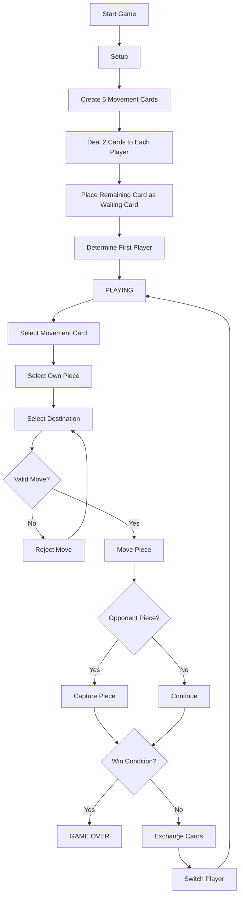
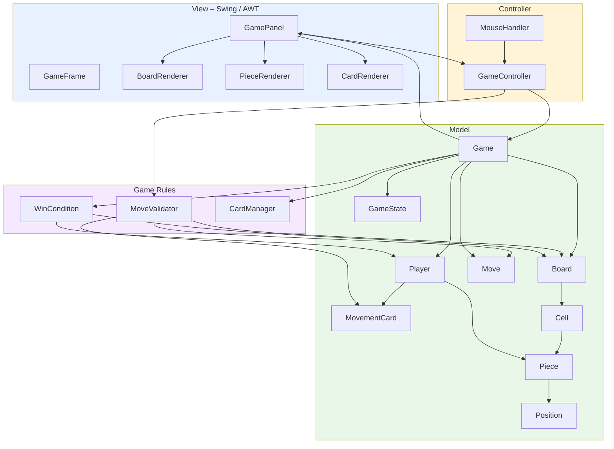
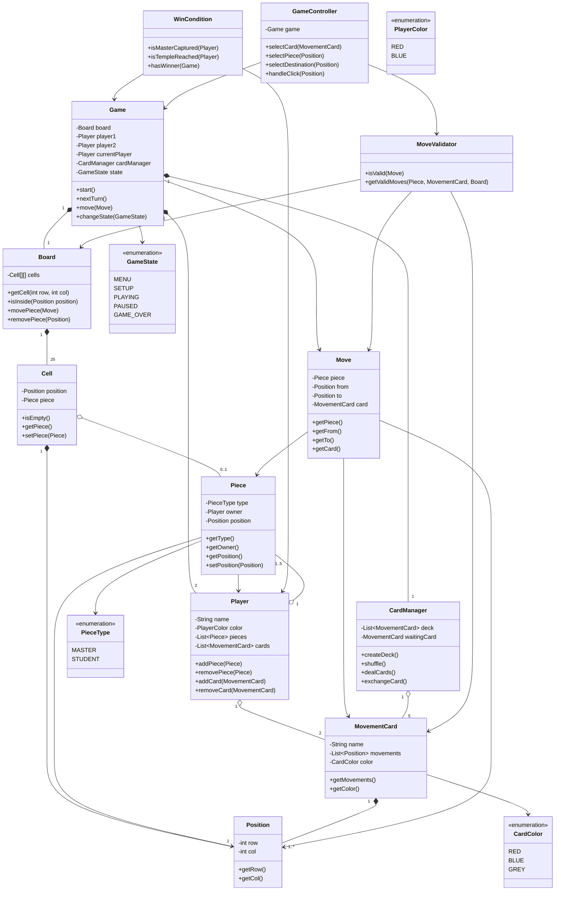
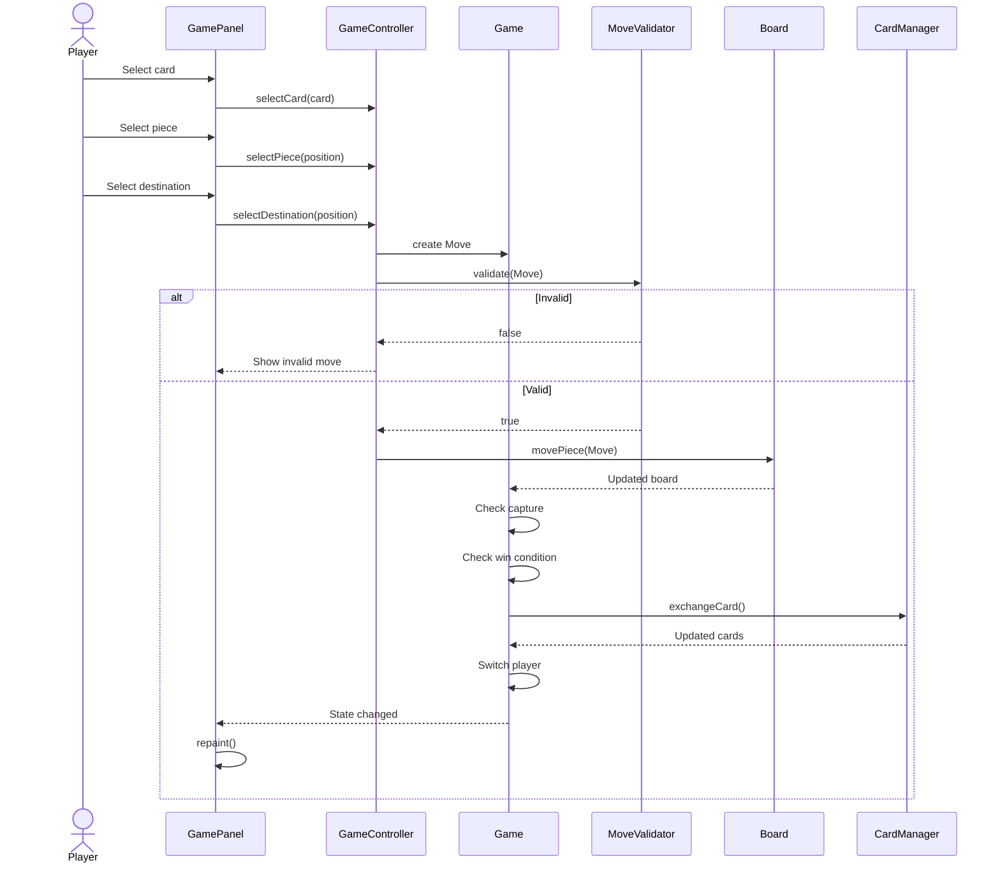
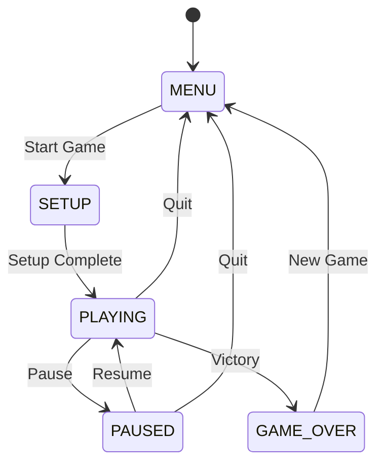

# Onitama – Java Board Game

## 1. Project Overview

Onitama is a 2-player strategy board game implemented in Java.

The project focuses on:

- Object-Oriented Programming (OOP)
- Java Swing / AWT
- Graphics and drawing
- Event handling
- Animation
- Timers
- Game state management
- Movement validation and collision detection
- Multithreading where appropriate
- Design patterns
- Save / Load functionality

The project is designed so that the main evaluation focus is on **program architecture, game logic, state management, event handling, animation, collision detection, concurrency, and code quality**, rather than purely visual appearance.

---

## 2. Game Rules

### Board

- Board size: **5 × 5**
- Number of players: **2**
- Each player has:
  - 1 Master
  - 4 Students
- Each player therefore has 5 pieces.

### Movement Cards

At the beginning of a game:

- 5 movement cards are randomly selected from the card deck.
- Each player receives 2 cards.
- The remaining card is placed beside the board as the waiting card.
- Only these 5 cards are used during the current game.
- The first player is determined by the color/mark on the waiting card.

### Turn

During a turn:

1. The current player chooses one of their two movement cards.
2. The player chooses one of their pieces.
3. The player chooses a destination according to the selected card.
4. The move is validated.
5. If valid, the piece moves.
6. An opponent's piece on the destination cell is captured.
7. The used card is exchanged with the waiting card.
8. The next player takes their turn.

If neither card provides a valid movement for a piece, the player still has to choose one card, but the piece may remain in its current position if no valid move exists.

### Movement Rules

A move is invalid when:

- The destination is outside the 5 × 5 board.
- The selected piece does not belong to the current player.
- The selected card does not belong to the current player.
- The destination contains one of the current player's own pieces.
- The movement does not match the selected movement card.

A move is valid when:

- The destination is inside the board.
- The piece belongs to the current player.
- The selected card belongs to the current player.
- The movement matches the selected card.
- The destination is empty or contains an opponent's piece.

### Win Conditions

A player wins when either:

1. The opponent's Master is captured.
2. The player's Master reaches the opponent's Temple.

---

# 3. Game Flow



---

# 4. High-Level Architecture

The project follows an **MVC-style architecture**.



---

# 5. Package Structure

```text
src/
└── com/onitama/
    │
    ├── Main.java
    │
    ├── model/
    │   ├── Game.java
    │   ├── Board.java
    │   ├── Cell.java
    │   ├── Position.java
    │   ├── Player.java
    │   ├── Piece.java
    │   ├── MovementCard.java
    │   ├── Move.java
    │   └── GameState.java
    │
    ├── rules/
    │   ├── MoveValidator.java
    │   └── WinCondition.java
    │
    ├── card/
    │   └── CardManager.java
    │
    ├── controller/
    │   └── GameController.java
    │
    ├── view/
    │   ├── GameFrame.java
    │   ├── GamePanel.java
    │   ├── BoardRenderer.java
    │   ├── PieceRenderer.java
    │   └── CardRenderer.java
    │
    ├── input/
    │   └── MouseHandler.java
    │
    └── util/
        └── ...
```

---

# 6. Class Diagram



---

# 7. Responsibility of Each Main Class

| Class | Responsibility |
|---|---|
| `Game` | Controls the overall game and turn flow |
| `Board` | Stores the 5 × 5 board and pieces |
| `Cell` | Represents one board cell |
| `Position` | Represents row/column coordinates |
| `Player` | Stores player's pieces and movement cards |
| `Piece` | Represents Master/Student |
| `MovementCard` | Stores one movement pattern |
| `Move` | Represents one attempted/valid move |
| `CardManager` | Creates, deals, and exchanges cards |
| `MoveValidator` | Checks whether a move is legal |
| `WinCondition` | Checks victory conditions |
| `GameController` | Connects user input to the game model |
| `GamePanel` | Main Swing game surface |
| `BoardRenderer` | Draws the board |
| `PieceRenderer` | Draws pieces |
| `CardRenderer` | Draws movement cards |
| `MouseHandler` | Handles mouse input |
| `GameState` | Represents current game state |

---

# 8. Important Design Principle

The project should separate **game logic** from **visual rendering**.

Bad:

```java
// GamePanel.java

if (mouseClicked) {
    if (pieceBelongsToPlayer && moveIsValid && ...) {
        // move piece
        // capture piece
        // change card
        // check victory
    }
}
```

Better:

```text
MouseHandler
      ↓
GameController
      ↓
Game
      ↓
MoveValidator
      ↓
Board / Player / CardManager
      ↓
Game state updated
      ↓
GamePanel.repaint()
```

The UI should primarily display the current state and send user input to the controller.

---

# 9. Turn Processing

A normal turn should conceptually follow:



---

# 10. Game State



---

# 11. Future Extensions

These should only be implemented after the core game works.

### Level 1 – Core

- Two-player local game
- Full movement rules
- Card exchange
- Capture
- Temple victory
- Master capture victory
- Turn management

### Level 2 – Game quality

- Animation
- Sound effects
- Pause / Resume
- Better UI
- Move highlighting
- Invalid move feedback

### Level 3 – Persistence

- Save game
- Load game
- Serialization
- Replay / move history

### Level 4 – Advanced

- AI opponent
- Multiple AI strategies
- Leaderboard
- Database
- Multiplayer networking

The team should avoid implementing advanced features before the core game is stable.

---

# 12. Suggested Development Order

```text
1. Model
   ↓
2. Board + Piece
   ↓
3. Movement Cards
   ↓
4. Move Validation
   ↓
5. Turn System
   ↓
6. Win Conditions
   ↓
7. Basic Swing UI
   ↓
8. Mouse Interaction
   ↓
9. Animation
   ↓
10. Save / Load
   ↓
11. AI / Multiplayer / Other extensions
   ↓
12. Testing + Refactoring
```

---

# 13. Team of 5 – Initial Responsibility

| Member | Main Responsibility |
|---|---|
| Member 1 | Model: `Game`, `Board`, `Cell`, `Position`, `Piece`, `Player` |
| Member 2 | Cards: `MovementCard`, `CardManager`, movement patterns |
| Member 3 | Rules & Controller: `Move`, `MoveValidator`, `WinCondition`, `GameController` |
| Member 4 | UI: Swing, rendering, mouse interaction |
| Member 5 | Animation, state management, save/load, testing and integration |

All members should participate in code review and integration.

---

# 14. Git Strategy

Recommended branches:

```text
main
  │
  ├── develop
  │    │
  │    ├── feature/model
  │    ├── feature/cards
  │    ├── feature/rules
  │    ├── feature/ui
  │    └── feature/animation
```

Recommended workflow:

```text
feature branch
      ↓
commit
      ↓
Pull Request
      ↓
Code Review
      ↓
develop
      ↓
Stable version
      ↓
main
```

Do not directly push experimental work to `main`.

---

# 15. Definition of Done – Core Version

The core version is considered complete when:

- [ ] Game starts correctly.
- [ ] Board is 5 × 5.
- [ ] Both players have 1 Master + 4 Students.
- [ ] Five cards are selected.
- [ ] Each player receives two cards.
- [ ] One waiting card exists.
- [ ] First player is determined.
- [ ] Player can select a card.
- [ ] Player can select their own piece.
- [ ] Valid destinations can be selected.
- [ ] Invalid destinations are rejected.
- [ ] Own pieces cannot be captured.
- [ ] Opponent pieces can be captured.
- [ ] Cards are exchanged after a turn.
- [ ] Turns alternate correctly.
- [ ] Master capture triggers victory.
- [ ] Temple occupation triggers victory.
- [ ] Game enters `GAME_OVER`.
- [ ] Player can start a new game.

---

# 16. Notes

The architecture should remain simple enough for a student project.

Do not add a class, pattern, framework, database, or thread unless it has a clear responsibility in the game.

The priority is:

**Correct game logic → clean architecture → stable interaction → animation/UI → extensions.**
